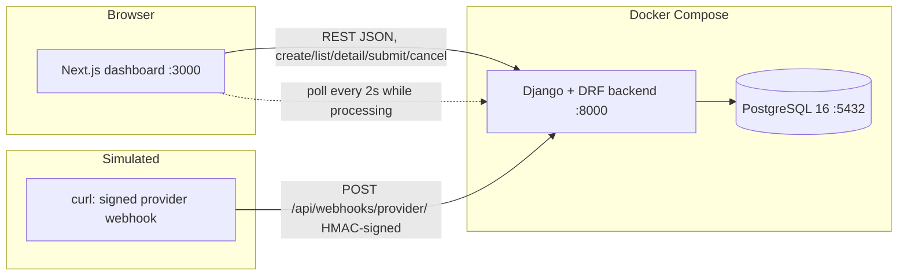

# Architecture

## Overview

A three-service Docker Compose monorepo: PostgreSQL, a Django REST API, and a
Next.js dashboard. All business logic lives in one Django app (`transfers`).
There is no Redis, no Celery, no background workers, and no real provider — the
provider is simulated by signed webhooks delivered with `curl`, and the
frontend polls while a transfer is `processing`.

## Container diagram

Text equivalent: browser → Next.js (`:3000`) → Django/DRF (`:8000`) →
PostgreSQL 16 (`:5432`); a signed webhook (simulated with `curl`) → DRF webhook
view → PostgreSQL. The frontend polls the detail endpoint every 2 s while a
transfer is `processing` because there is no push channel.

## Data model

Defined in `backend/transfers/models.py` (migrations `0001`–`0003`).

### `Transfer`

| Field | Type | Notes |
| --- | --- | --- |
| `id` | UUID pk | `uuid.uuid4`, immutable |
| `reference` | CharField(40), unique | `TRF-<hex>`, generated in `save()` |
| `amount` | Decimal(20, 2) | `> 0` (check constraint + validator) |
| `currency` | CharField(3) | `NGN`, `USD`, `GBP`, `EUR` |
| `recipient_ref` | CharField(255) | |
| `status` | CharField(16) | `pending`, `processing`, `completed`, `failed`, `cancelled` |
| `provider_transfer_id` | CharField(255), null, unique | assigned on submit |
| `idempotency_key` | CharField(255), unique | from the request header |
| `request_fingerprint` | CharField(255) | SHA-256 of canonicalized create body |
| `created_at` / `updated_at` | DateTime | auto timestamps |

Constraints: `amount > 0`, `status` in the valid set.

### `ProviderEvent`

| Field | Type | Notes |
| --- | --- | --- |
| `id` | BigAuto pk | |
| `transfer` | FK → `Transfer` (CASCADE) | `related_name="provider_events"` |
| `event_id` | CharField(255), unique | provider event id |
| `provider_transfer_id` | CharField(255), indexed | echoes the submit id |
| `provider_status` | CharField(16) | `completed`, `failed` |
| `occurred_at` | DateTime, null | provider timestamp |
| `payload_fingerprint` | CharField(255) | SHA-256 of canonicalized event |
| `outcome` | CharField(32) | `applied`, `ignored_terminal` |
| `received_at` | DateTime | auto, ordering `-received_at` |

Raw payloads and signatures are never stored — only fingerprints and outcomes.

## State transition table

Enforced in `backend/transfers/services.py` (`transition_transfer`), which rows
the transfer with `SELECT ... FOR UPDATE`, reads the *persisted* status, applies
one allowed transition, and raises `InvalidTransferTransition` otherwise.

| From | To | Trigger | Where handled |
| --- | --- | --- | --- |
| `pending` | `processing` | `POST /transfers/{id}/submit/` | `submit` view → service; assigns `provider_transfer_id` |
| `pending` | `cancelled` | `POST /transfers/{id}/cancel/` | `cancel` view → service |
| `processing` | `completed` | `POST /webhooks/provider/` | webhook view → service, outcome `applied` |
| `processing` | `failed` | `POST /webhooks/provider/` | webhook view → service, outcome `applied` |

`completed`, `failed`, and `cancelled` are **terminal**; no transition out of
them is allowed. Any other transition attempt returns `409` (or raises
`InvalidTransferTransition` in the service).

## Webhook handling rules

For a *signed, valid* event, in order:

| Condition | Result |
| --- | --- |
| `event_id` already recorded, same payload | `200` duplicate, nothing written |
| `event_id` already recorded, different payload | `409` conflict |
| no transfer with `provider_transfer_id` | `404`, nothing written |
| transfer is `pending` | `409` (not submitted), nothing written |
| transfer is `processing` | apply `completed`/`failed`, record `applied` |
| transfer already terminal | record `ignored_terminal`, `200` ack |

Signature failure (missing, malformed prefix, bad HMAC) returns `401` before
any parsing or writes.

## Request flows

### Create transfer (idempotent)

1. `POST /api/transfers/` with `Idempotency-Key` header.
2. Missing/too-long key → `400`. Invalid body → `400`.
3. Normalize body → canonical fingerprint.
4. Insert with unique `idempotency_key` inside `transaction.atomic()`.
5. On `IntegrityError`: same key + same fingerprint → replay `200`; same key +
   different fingerprint → `409`.

### Submit / cancel

1. `POST /api/transfers/{id}/submit/` (or `/cancel/`).
2. Unknown or malformed UUID → `404`.
3. `transition_transfer` locks the row, validates the persisted status, and
   moves it (`pending → processing` / `pending → cancelled`).
4. On submit, the locked row also receives `provider_transfer_id = prov_<hex>`.
5. Illegal transition → `409`.

### Provider webhook

1. `POST /api/webhooks/provider/` with `X-Provider-Signature: sha256=<hex>`.
2. Verify HMAC over raw `request.body` with `PROVIDER_WEBHOOK_SECRET` → else `401`.
3. Parse JSON → `400` if malformed; validate serializer (`completed`/`failed`)
   → `400` if invalid.
4. Inside one `transaction.atomic()`: dedupe `event_id`, look up the transfer by
   `provider_transfer_id`, apply the transition or record `ignored_terminal`,
   and insert the `ProviderEvent`.

### Frontend polling

`app/transfers/[id]/page.tsx` fetches the transfer and, while `status ===
"processing"`, re-fetches every 2 s (`setInterval`), stopping at terminal
states. The dashboard list has a manual Refresh button.

## Key implementation files

| Concern | File |
| --- | --- |
| Settings, secrets, DB URL | `backend/config/settings.py` |
| Routing | `backend/config/urls.py`, `backend/transfers/urls.py` |
| Models | `backend/transfers/models.py` |
| State machine | `backend/transfers/services.py` |
| HTTP views (API + webhook) | `backend/transfers/views.py` |
| Serializers | `backend/transfers/serializers.py` |
| Frontend API client | `frontend/lib/api.ts` |
| Detail page + polling | `frontend/app/transfers/[id]/page.tsx` |
| Dashboard | `frontend/app/page.tsx` |
| Compose | `compose.yml` |
| CI | `.github/workflows/ci.yml` |
